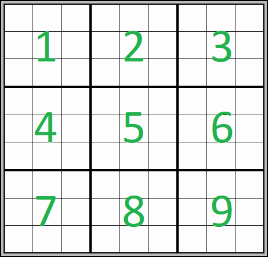

# 
<!-- PROJECT LOGO -->
<br />
<div align="center">
  <a href="https://github.com/github_username/repo_name">
    
  </a>

<h3 align="center">Python-Sudoku-Solver</h3>

</div>


<!-- TABLE OF CONTENTS -->
<details>
  <summary>Table of Contents</summary>
  <ol>
    <li><a href="#about-the-project">About The Project</a>
    <li><a href="#built-with">Built With</a></li>
    <li><a href="#app">App</a></li>
    <li><a href="#code">Code</a></li>
    <li><a href="#contributing">Contributing</a></li>
    <li><a href="#license">License</a></li>
    <li><a href="#contact">Contact</a></li>
    <li><a href="#acknowledgments">Acknowledgments</a></li>
  </ol>
</details>


<!-- ABOUT THE PROJECT -->
## About The Project

 The objective of this project is to scrape data for jobs site to analyze and rank the top skill employer our seeking to fill Data Analysis job positions in Canada.


### Built With

* [Python][Python-url]
* [Jupyter][Jupyter-url]
* [MecSimCalc][MecSimCalc-url]
* [pandas][pandas-url]


### App
<a href="https://mecsimcalc.com/app/3166730/sudoku_solver" 
   target="_blank"></a>

### <p align="center"><a href="https://mecsimcalc.com/app/3166730/sudoku_solver">Try App</a></p>


### Code

```
# code sources https://www.techwithtim.net/tutorials/python-programming/sudoku-solver-backtracking/

board = [
    [7,8,0,4,0,0,1,2,0],
    [6,0,0,0,7,5,0,0,9],
    [0,0,0,6,0,1,0,7,8],
    [0,0,7,0,4,0,2,6,0],
    [0,0,1,0,5,0,9,3,0],
    [9,0,4,0,6,0,0,0,5],
    [0,7,0,3,0,0,0,1,2],
    [1,2,0,0,0,7,4,0,0],
    [0,4,9,2,0,6,0,0,7]
]


def solve(bo):
    find = find_empty(bo)
    if not find:
        return True
    else:
        row, col = find

    for i in range(1,10):
        if valid(bo, i, (row, col)):
            bo[row][col] = i

            if solve(bo):
                return True

            bo[row][col] = 0

    return False


def valid(bo, num, pos):
    # Check row
    for i in range(len(bo[0])):
        if bo[pos[0]][i] == num and pos[1] != i:
            return False

    # Check column
    for i in range(len(bo)):
        if bo[i][pos[1]] == num and pos[0] != i:
            return False

    # Check box
    box_x = pos[1] // 3
    box_y = pos[0] // 3

    for i in range(box_y*3, box_y*3 + 3):
        for j in range(box_x * 3, box_x*3 + 3):
            if bo[i][j] == num and (i,j) != pos:
                return False

    return True


def print_board(bo):
    for i in range(len(bo)):
        if i % 3 == 0 and i != 0:
            print("- - - - - - - - - - - - - ")

        for j in range(len(bo[0])):
            if j % 3 == 0 and j != 0:
                print(" | ", end="")

            if j == 8:
                print(bo[i][j])
            else:
                print(str(bo[i][j]) + " ", end="")


def find_empty(bo):
    for i in range(len(bo)):
        for j in range(len(bo[0])):
            if bo[i][j] == 0:
                return (i, j)  # row, col

    return None

print_board(board)
solve(board)
print("___________________")
print_board(board)

```

## Contributing

Contributions are what make the open source community such an amazing place to learn, inspire, and create. Any contributions you make are **greatly appreciated**.

If you have a suggestion that would make this better, please fork the repo and create a pull request. You can also simply open an issue with the tag "enhancement".
Don't forget to give the project a star! Thanks again!

1. Fork the Project
2. Create your Feature Branch
3. Commit your Changes
4. Push to the Branch
5. Open a Pull Request


S
<!-- LICENSE -->
## License

Distributed under the MIT License. See [LICENSE][LICENSE-url].txt` for more information.


<!-- CONTACT -->
## Contact

Michael Jean -  [LinkedIn](https://www.linkedin.com/in/michaeljean7101/)

Project Link: [https://github.com/michael7101/Data-Analyst-Jobs-in-Canada](https://github.com/michael7101/Data-Analyst-Jobs-in-Canada)


<!-- ACKNOWLEDGMENTS -->
## Acknowledgments

* [Techwith Tim](Tech-with-Tim-url)
* [Best-README-Template](Best-README-Template-url)
* [MecSimCalc](mecsimcalc-url)


<p align="right">(<a href="#readme-top">back to top</a>)</p>


[product-screenshot]: images/screenshot.png
[Python-url]: https://www.python.org/
[Jupyter-url]: https://jupyter.org/
[MecSimCalc-url]: https://mecsimcalc.com/
[pandas-url]: https://pandas.pydata.org/
[LICENSE-url]: https://github.com/michael7101/Data-Analyst-Jobs-in-Canada/blob/b346a5f7ece8aab1d0bc7154f22f8102ac948367/LICENSE
[Try-App-url]: https://mecsimcalc.com/app/3166730/sudoku_solver
[Tech-with-Tim-url]: https://www.techwithtim.net/tutorials/python-programming/sudoku-solver-backtracking/
[Best-README-Template-url]: https://github.com/othneildrew/Best-README-Template
[mecsimcalc-url]: https://mecsimcalc.com/